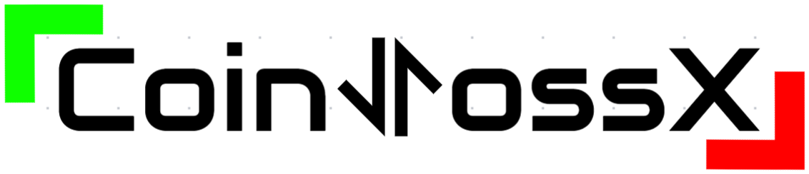

# Market Simulations with Hawkes and CoinTossX 

## Authors
* Ivan Jericevich
* Patrick Chang
* Tim Gebbie

## Description
We consider a 10-variate Hawkes process with simple rules to simulate common order types which are submitted to a matching engine. The resulting trade and quote data from the simulations are then calibrated and compared with the original order generating process to determine whether realistic matching rules distort model parameters. Evidence from validation and hypothesis tests suggest that the true model specification is significantly distorted and can be attributed to market mechanics and practical considerations.

## Prerequisites
* [Julia](https://julialang.org) programming langauge
* A text editor or IDE such as [Atom](https://flight-manual.atom.io/getting-started/sections/installing-atom/), [VS Code](https://code.visualstudio.com/download) or [Jupyter](https://jupyter.org/install)
* CoinTossX matching engine. The version used to obtain these results is version ... For instructions on how to install, start, and use CoinTossX refer to [CoinTossX](https://github.com/dharmeshsing/CoinTossX)

## Usage
Clone the repository
```sh
git clone https://github.com/IvanJericevich/IJPCDHTG-CoinTossX.git
```
Packages can be installed using
```julia
Pkg.add("...")
```
Each script contains examples of how to run the relevant functions. [CoinTossXUtilities.jl](../IJPCDHTG-CoinTossX/main/Scripts/HawkesSimulation.jl) contains the important functions for interacting with CoinTossX. [HawkesSimulation.jl](../IJPCDHTG-CoinTossX/main/Scripts/HawkesSimulation.jl) is the script used to submit Hawkes generated orders via each model to CoinTossX. [HawkesCalibration.jl](../IJPCDHTG-CoinTossX/main/Scripts/HawkesCalibration.jl) calibrates parameters to the simulation data from each model and [HawkesValidation.jl](../IJPCDHTG-CoinTossX/main/Scripts/HawkesValidation.jl) performs the necessary validation tests on the resulting paramters. Important to the calibration of parameters is the classification of Hawkes events in the TAQ data. This is done by the "PrepareHawkesData" function in [DataCleaning.jl](../IJPCDHTG-CoinTossX/main/Scripts/DataCleaning.jl).

### Data structure
Trade and quote data from both model simulations are provided in [Data](../IJPCDHTG-CoinTossX/main/Data). Cleaned level 1 LOB data for both models are provided (for visualisation) as well, along with the calibrated parameters. The exact files and their contents are as follows:
* [OrdersSubmitted_1.csv](../IJPCDHTG-CoinTossX/main/Data/Model1/OrdersSubmitted_1.csv) contains all the order sent to CoinTossX along with "un-split" trades.
* [Trades_1.csv](../IJPCDHTG-CoinTossX/main/Data/Model1/Trades_1.csv) contains all the "split" trades whose IDs references the LOs in OrdersSubmitted_1.csv against which they were executed.
* [L1LOB.csv](../IJPCDHTG-CoinTossX/main/Data/Model1/L1LOB.csv) contains the cleaned level 1 LOB data.
* [Parameters.csv](../IJPCDHTG-CoinTossX/main/Data/Model1/Parameters.csv) contains the calibrated paramters of the corresponding model in vector form.
